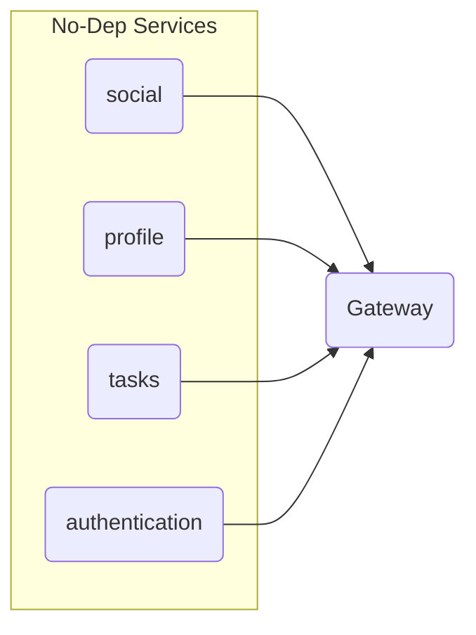

# OptomisticTanuki

The optomisitc Tanuki intends to be a platform for collaborating and community support of personal and professional goals. Currently the project provides an api surface for authentication, social posts, goal tracking, note taking, and inter-user interaction. there is design for a UI starting at a later date. The main components of the application suite are Authentication, Gateway, Social, Profile, and Tasks. All but the gateway project are served as TCP micoservices that can be configured to listen on any port, and the gateway can be configured to point to each service at any port. The application currently uses postgres for maintaining the database material. 

# Development Setup

## Application Configs

In each application, we expect a `config.yaml` file in the `src/assets` folder in each application. Each service at a minimum requires a `listenPort` key that defines the port the service will listen on. If the service requires database information, it will require a `database` block defining the connection to postgresql.

*Non Sensative keys in config literals are shown as their default values.*

* [Authentication Config](#authentication-config)
* [Gateway Config](#gateway-config)
* [Profile Config](#profile-config)
* [Social Config](#social-config)
* [Tasks Config](#tasks-config)

## Docker Dependencies
Once that is complete, please run the `start-docker-deps.sh` which will launch the postgres database, and migrate the databases for use.

## Runing the Applciation
The application suite uses the `nx` workspace tooling to provide quick setup and startup for all applcations in the suite. Please see [Nx.dev](http://nx.dev/) for more details.

For each application we are mainly concerned with the `serve` and `build` commands. To start an applcation, use `nx serve <app>` the trick is the order of startup. This is the recommended order:



## Application Configs

### Authentication Config
Authentication configuration requires a few secrets that aren't allowed in Git unique to the application. It also requires `listenPort` and `database` keys.

```yaml
listenPort: 3001
database:
  host: localhost
  port: 5432
  user: postgres
  password: postgres
  database: ot_authentication
auth:
  jwt_secret: |
    YOUR_SECRET_KEY_HERE
```


### Gateway Config
Gateway requires a `listenPort` but not the `database` block. It does however require a unique config block that represents the other applciations. 
```yaml
listenPort: 3000
services:
  authentication:
    name: authentication
    transport: TCP
    host: 127.0.0.1
    port: 3001
  profile:
    name: profile
    transport: TCP
    host: 127.0.0.1
    port: 3002
  social:
    name: social
    transport: TCP
    host: 127.0.0.1
    port: 3003
  tasks:
    name: tasks
    transport: TCP
    host: 127.0.0.1
    port: 3004
```

### Profile Config
Only standard `listenPort` and `database` required,
```yaml
listenPort: 3002
database:
  host: localhost
  port: 5432
  user: postgres
  password: postgres
  database: ot_profile
```

### Social Config
Only standard `listenPort` and `database` required,
```yaml
listenPort: 3003
database:
  host: localhost
  port: 5432
  user: postgres
  password: postgres
  database: ot_social
```
### Tasks Config
Only standard `listenPort` and `database` required,
```yaml
listenPort: 3004
database:
  host: localhost
  port: 5432
  user: postgres
  password: postgres
  database: ot_tasks
```

